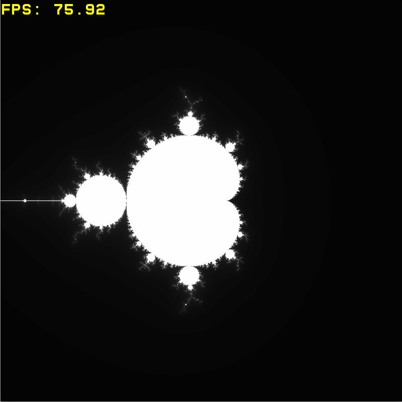

# SIMD
These programs were made for checking the efficiency of using SIMD instructions in calculations. For that purpose, Mandelbrot set and classical alpha blending were implemented.

SIMD (Single Instruction, Multiple Data) is a technique that allows a single instruction to be executed on multiple pieces of data at the same time with help of special processor's module, thus improving performance. 

## Mandelbrot set

### Mathematical algorithm

We have a plane with X and Y coordinats. For every dot of the plane we calculate a sequence according to the following algorithm:
- $X_{n+1} = X_n^2 - Y_n^2 + X_0$
- $Y_{n+1} = 2 \cdot X_n \cdot Y_n + Y_0$

We stop calculatings if we reach 255 iteration, or if position of the last calculated sequence point is located farther from the center than the maximum distance:
- $X_{n}^2 + Y_{n}^2 > MaxDistance^2$

In my example $MaxDistance = 10&

After the end of that step we can determine the color of the dot we started from. I decided to use just $2 \cdot C$ for every standart color of the pixel (red, green, blue), getting white color with different brightness, where $C$ is amount of iterations before sequence calculations were finished.

### Analysing the perfromance

Two algorithms were implemented: calculations for every single dot and calculations for a vector of 8 dots next to each other using __m256 variables (SIMD registers). Now we compare the speed of the calculations with standart method and with using SIMD instructions. Also compare for different optimisation flags of GCC compiler:

Table, in the cells of which FPS (frames per second), showing the amount of planes that can be handled per second depending on compiler's flag and variant of the algorithm (drawing is turned off, value is counted in the short time after program's work started (over some time OS's resources are being redistributed and program works faster)):

|             |     No SIMD       |       SIMD     |
| :------:    | :---------------: | :------------: | 
|    -O0      |      4.81         |     13.46      |
|    -O1      |      12.15        |     52.40      |
|    -O2      |      11.90        |     51.50      |
|    -O3      |      11.98        |     51.00      |
|   -Ofast    |      13.29        |     54.50      |

We see, that regardless compiler flag using SIMD instructions speeds up the calculations approximately 4 times. We also can conclude that GCC compiler can't improve your code using SIMD instructions, so you may not rely only on its' optimisation in the case of speeding up the code with plenty of the same calculations.

## Alpha Blending

### Algorithm

We have two images with pixels codded in RGBA format. Our task is to overlay them.

Classical algorithm is that every standart color (red, green, blue) of every overlayed pixel is changed for the value:

- $Color_{new} = Color_{ForegroundImagePixel} \cdot \alpha + Color_{BackgroundImagePixel} \cdot (1 - \alpha)$

where $\alpha$ is transparency of foreground's image's pixel expressed as a number from 0 to 1. Such calculations are performed for every overlayed pixel.

### Analysing the perfromance

Standart algorithm and its version with SIMD instruction were implemented. Second version of algorithm is less trivial in implementation due to necessity to have place for saving elder bits of the result of multiplying the numbers, so in that version of algorithm a planty of manipulations with bits were needed.

In the next table we compare the speed of creating the image depending on version of the algorithm and optimisation flag of GCC (time is expressed in milliseconds):

|             |     No SIMD       |       SIMD     |
| :------:    | :---------------: | :------------: | 
|    -O0      |      0.305        |     0.581      |
|    -O1      |      0.152        |     0.019      |
|    -O2      |      0.137        |     0.019      |
|    -O3      |      0.138        |     0.018      |
|   -Ofast    |      0.135        |     0.020      |

We see, that combining SIMD instructions leads to speeding up for approximately 7 times. The reason of dramatic speeding up of work with SIMD instruction after adding optimisation flag was found with help of gotbold disassembly - without optimisations program referes to the memory on every step of the work, also program executes much more commands then version with optimisation.

# Conclusion

Using SIMD instructions in the code with plenty of the same calculations can speed it up many times. Code becomes a bit harder to read, but the results of getting over yourself and writing more effective code are impressing!
