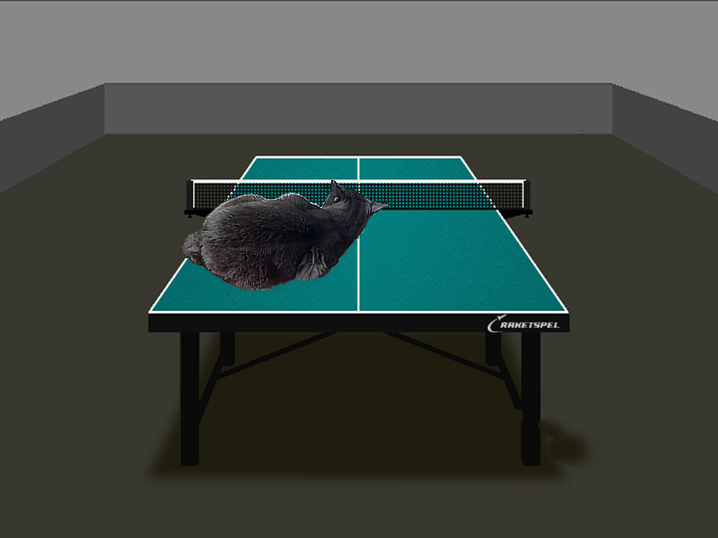

# SIMD
These programs were made for checking the efficiency of using SIMD instructions in calculations. For that purpose,I implemented Mandelbrot set and classical alpha blending.

SIMD (Single Instruction, Multiple Data) is a technique that allows to execute a single instruction on multiple pieces of data at the same time. This technique can improve performance many times. 

## Mandelbrot set

### Mathematical algorithm

Imagine we have a plane with X and Y coordinates. For every dot of the plane, we calculate a sequence according to the following algorithm:
- $X_{n+1} = X_n^2 - Y_n^2 + X_0$
- $Y_{n+1} = 2 \cdot X_n \cdot Y_n + Y_0$

We stop calculating if we reach 255's iteration or position of the last calculated sequence point is located farther from the center than the maximum distance:
- $X_{n}^2 + Y_{n}^2 > MaxDistance^2$

In my example $MaxDistance = 10$

After the end of that step, we can set the color of the dot we started from. I decided to use just $2 \cdot C$ for every standard color of the pixel (red, green, blue), getting the white color with different brightness, where $C$ is an amount of iterations before sequence calculations were finished.

### Analysing the perfromance

I implemented two algorithms: calculations for every single dot and calculations for a vector of 8 dots next to each other. To do it I used __m256 variables (SIMD registers). Now we compare the speed of the calculations with standard method and with using SIMD instructions. Also we compare the performance with different optimisation flags of the GCC compiler.

In the table below we will display FPS (frames per second). It shows the amount of planes that can be handled per second. FPS precisely depends on compiler flag and variant of the algorithm.

|             |     No SIMD       |       SIMD     |     Boost      |   
| :------:    | :---------------: | :------------: | :------------: |
|    -O0      |      4.81         |      13.46     |      2,8x      |
|    -O1      |    12.15 (+353%)  |  52.40 (+489%) |      4,3x      |
|    -O2      |    11.90 (+347%)  |  51.50 (+482%) |      4,3x      |
|    -O3      |    11.98 (+349%)  |  51.00 (+478%) |      4,3x      |
|   -Ofast    |    13.29 (+376%)  |  54.50 (+505%) |      4,1x      |

We see, that regardless compiler flag using SIMD instructions speeds up the calculations approximately 4 times. We also can conclude GCC compiler can't improve your code using SIMD instructions. So you may not rely only on its' optimisation in the case of speeding up the code with plenty of the same calculations.

## Alpha Blending

### Algorithm

We have two images with pixels in RGBA format. Our task is to overlay them.

Classical algorithm assumes that every standard color (red, green, blue) of every overlayed pixel is changed to the value:

- $Color_{new} = Color_{ForegroundImagePixel} \cdot \alpha + Color_{BackgroundImagePixel} \cdot (1 - \alpha)$

where $\alpha$ is transparency of foreground's image's pixel expressed as a number from 0 to 1. Such calculations are performed for every overlayed pixel.

### Analysing the perfromance

I implemented standard algorithm and its version with SIMD instruction. In implementation of the second version we used vectors of 8 numbers and multiplied them. 1 byte was not enough to save the result of multiplying, so you can find a planty of manipulations with bits in the code. That might be not as obvious as standard version of alpha blending. 

In the next table we compare the speed of creating the image depending on version of the algorithm and optimisation flag of GCC. Time is expressed in milliseconds:

|             |     No SIMD       |       SIMD     |       Boost    |
| :------:    | :---------------: | :------------: | :------------: |
|    -O0      |      0.305        |     0.581      |       0,5x     |
|    -O1      |      0.152        |     0.019      |       8,0x     |
|    -O2      |      0.137        |     0.019      |       7,2x     |
|    -O3      |      0.138        |     0.018      |       7,7x     |
|   -Ofast    |      0.135        |     0.020      |       6,8x     |

We see, that combining SIMD instructions leads to speeding up for approximately 7,5 times. There's a strange behaviour of SIMD version of the program with the flag -O0. The reason was found with help of gotbold disassembly. Without any optimisations the program refers to the memory on every step of the work, also program executes much more commands then version with optimisation. Because of that, the SIMD version without optimisation became the slowest in the sample.

# Conclusion

Using SIMD instructions in the code with plenty of the same calculations can speed it up many times. The code becomes a bit harder to read, but the results of getting over yourself and writing more effective code are impressing!
